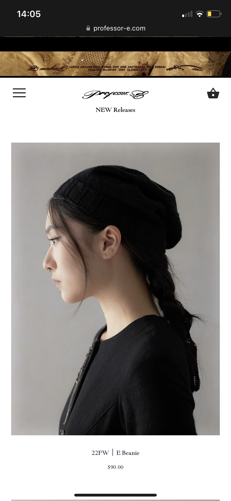
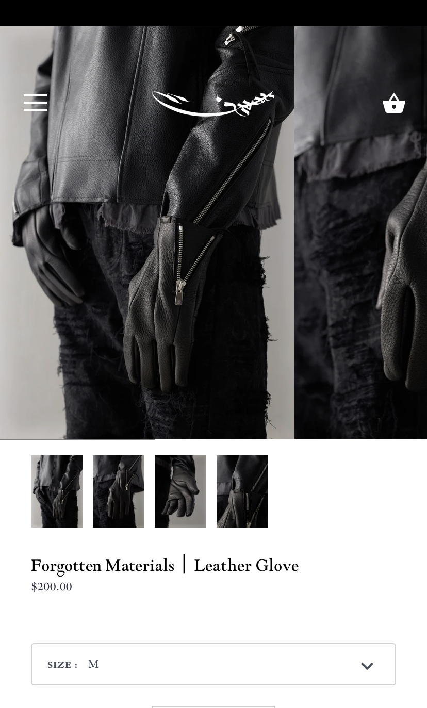
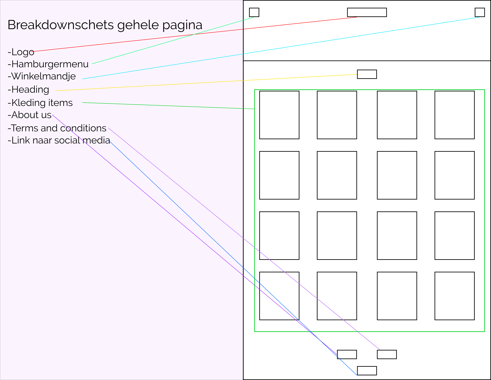
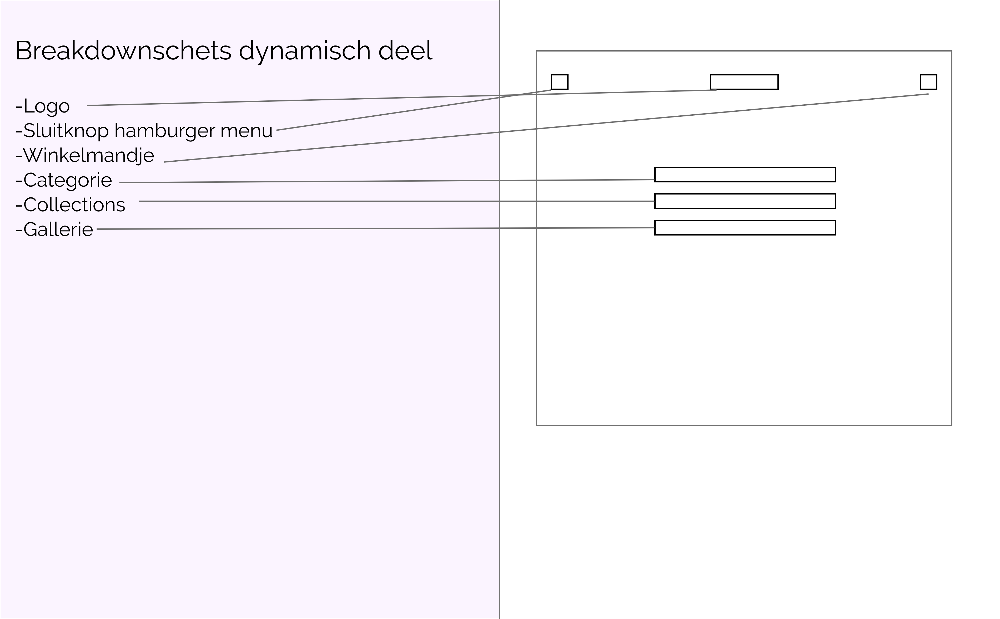
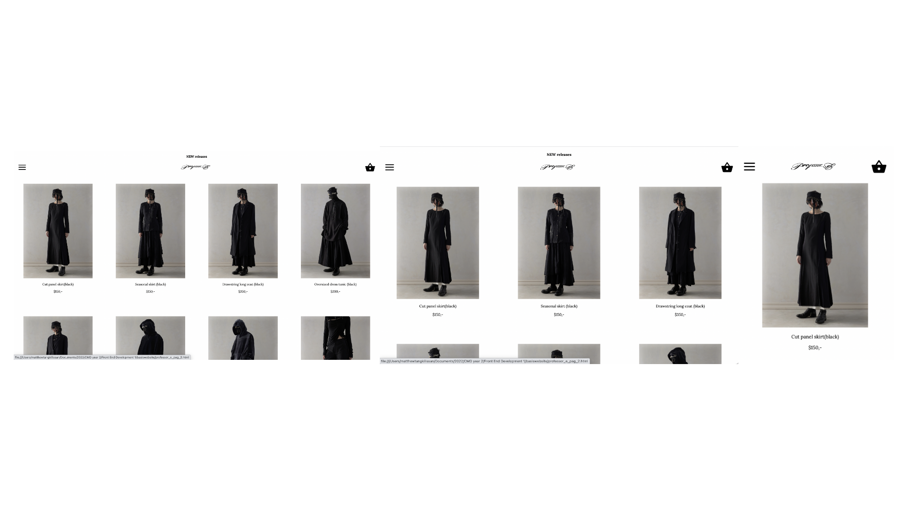
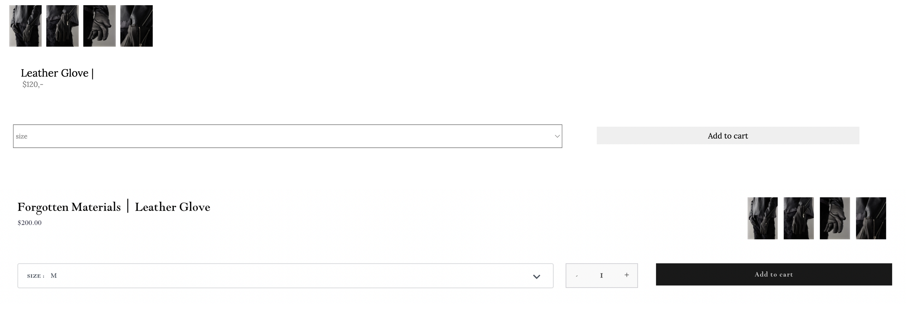

# Procesverslag
Markdown is een simpele manier om HTML te schrijven.  
Markdown cheat cheet: [Hulp bij het schrijven van Markdown](https://github.com/adam-p/markdown-here/wiki/Markdown-Cheatsheet).

Nb. De standaardstructuur en de spartaanse opmaak van de README.md zijn helemaal prima. Het gaat om de inhoud van je procesverslag. Besteedt de tijd voor pracht en praal aan je website.

Nb. Door *open* toe te voegen aan een *details* element kun je deze standaard open zetten. Fijn om dat steeds voor de relevante stuk(ken) te doen.

## Jij

  
uitwerken voor kick-off werkgroep

  ### Auteur:
  Matthew Tangkilissan 

  #### Je startniveau:
  startniveau: rood

  #### Je focus:
  focus: responsive
 

## Je website

  
uitwerken voor kick-off werkgroep

  ### Je opdracht:
  https://professor-e.com/

  #### Screenshot(s) van de eerste pagina (small screen): 
  hoofdpagina
  

  #### Screenshot(s) van de tweede pagina (small screen):
  detailpagina
  
 

## Toegankelijkheidstest 1/2 (week 1)

  
uitwerken na test in 1e werkgroep

  ### Bevindingen
  - Een screenreader is bijna niet te gebruiken op de echte website van professor E.
  - Tabben werkt heel primitief en laat ook key details eruit.
  - Vanwege de simplistische lay-out is de site wel te gebruiken met eventuele motorische beperkingen.
  - Site is nog steeds te gebruiken met visuele beperkingen behalve met blurred vision. Tekst in buttons zijn lastig te lezen.

  #### Screenreader
  Dropdown menu wordt niet uitgelezen
  Afbeeldingen zijn niet goed beschreven
  Er missen links bij het bestellen
  Prijs niet zichtbaar bij bestellen
  Voorpagina link tekst klopt niet 

 
  Pas de alt aan voor alle afbeeldingen. Is op dit moment nog te veel herhaling van de titel in de screenreader.
  Geef buttons een beschrijving van functie i.p.v "button 1, button 2, button 3" etc.
  Logo aanpassen zodat het niet alleen maar wordt voorgelezen als link.

  #### Muis en Toetsenbord 
  met tabben heb je drie links op categorie scherm: afbeelding, naam en prijs
  Met tabben in winkelwagen prijs niet zichtbaar

  
  Tabben werkt over het algemeen naar behoren. Alleen is het nu niet te zien waar de focus zich bevind als de caroussel buttons worden geselecteerd. Ook tabt hij de colom verticaal i.p.v de rij met opties horizontaal af te gaan. Pas grid aan zodat er van links naar rechts gelezen wordt. Vergroot border van focus state en geef een scherpere kleur als je door de caroussel tabt.

  #### Motoriek (shocks, elastiekjes)
  
  De website was te navigeren met het shock apparaat. Het scrollen en klikken verloopt redelijk normaal. Hetzelfde geldt bij het gebruik van de elastiekjes. Als je wilt bestellen ontstaan er problemen. Een formulier selecteren en typen verloopt heel lastig.

  Al het scroll en klikwerk gaat prima. Detail werk als iets moeten typen verloopt nog moeizaam maar dit is een hardware probleem en ligt niet aan de site.

  #### Visueel (brillen, contrast, kleurenblind, dark/light). 
  Met de brillen was de site nog steeds goed leesbaar. De enige kleuren die gebruikt worden door de site zijn zwart en wit. Alleen als je het scherm op blurred zet wordt het lastig. Tekst is dan soms niet te onderscheiden van de achtergrond.

  Dit is makkelijk aan te passen door de grote van de tekst te veranderen.

## Breakdownschets (week 1)

  
uitwerken na afloop 2e werkgroep

  ### de hele pagina: 
  

  ### dynamisch deel (bijv menu): 
  

 

## Voortgang 1 (week 2)

  
uitwerken voor 1e voortgang

  ### Stand van zaken
  ### Wat goed ging
  -Het opstellen van de HTML.
  -Het verbinden met de CSS.
  -Het verbinden met de JS.

  ### Wat ging lastig
  -Al het andere.
  -Images importeren in HD.
  -Files de juiste naam geven zodat ze daadwerkelijk op je website verschijnen.

  ### Agenda voor meeting
  samen met je groepje opstellen

  | Ryan      | Charity         | Quinty  | Matthew       
  | ---            | ---        | ---     | ---          
  | dit bespreken  | en dit     | ..      | -Moet je ook alle animaties overnemen?         
  | en dat ook nog | dit als e  | ..      | -Wordt jouw site naast de echte site gezet en vergeleken
  | ...            | ...        | ..      |           

  ### Verslag van meeting
  hier na afloop snel de uitkomsten van de meeting vastleggen

  - Je site hoeft geen complete kopie te zijn van de echte website.
  - Vermijd divs en classes zoveel mogelijk.
  

## Voortgang 2 (week 3)

  
uitwerken voor 2e voortgang

  ### Stand van zaken
  Dit ging goed
  -Alle elementen staan nu op volgorde op de website en keurig in de HTML.
  -De basis lay-out is gelegde met CSS.
  -Afbeeldingen zijn in HD door het veranderen van png naar webp.
  -Elementen zijn nu beter leesbaar.

  ### Dit ging lastig
  -Hamburger menu begreep ik niet en wou niet meewerken.
  -Geexpirimenteerd met grid maar lukte niet om responsive te maken.
  

  ### Agenda voor meeting
  samen met je groepje opstellen

  | Ryan     | Quinty         | Charity   | Matthew       
 "Hoe kan ik individuele elementen selecteren in css zonder classes?", "Wat doe ik verkeerd bij mijn hamburger menu?". 

                                          

  ### Verslag van meeting
  hier na afloop snel de uitkomsten van de meeting vastleggen

  - Breng je hamburgermenu button buiten de nav.
  - Gebruik direct-child selectors and attribute selectors.
  

## Toegankelijkheidstest 2/2 (week 4)

  
uitwerken na test in 8e werkgroep

  ### Bevindingen
  Lijst met je bevindingen die in de test naar voren kwamen (geef ook aan wat er verbeterd is):
  (OUD)
  - Een screenreader is bijna niet te gebruiken op de echte website van professor E.
  - Tabben werkt heel primitief en laat ook key details eruit.
  - Vanwege de simplistische lay-out is de site wel te gebruiken met eventuele motorische beperkingen.
  - Site is nog steeds te gebruiken met visuele beperkingen behalve met blurred vision. Tekst in buttons zijn lastig te lezen.

  ### (VERBETERD)
  -Op mijn eigen site tabt hij de lijst met items wel van links naar rechts i.p.v boven naar beneden zoals op de echte site.
  -Op mijn site is de tekst groter gemaakt om het beter leesbaar te maken.
  -Lay-out is lichtelijk verbeterd. Alle items staan even ver van elkaar af zowel horizontaal als verticaal.
  

  ### (NIEUW)
  -Voice over leest twee keer dezelfde informatie. Alt moet aangepast worden zodat artikel naam niet achter elkaar herhaalt wordt.
  -Tijdens tabben soms onduidelijk waar je op staat. Achtergrond in focusstate wordt toegepast.
  

  #### Screenreader
  De screenreader leest dat de afbeelding een link is, in welke categorie het artikel valt, de naam van het product en hoeveel het kost.

  #### Muis en Toetsenbord 
  Vanwege de simpele lay-out is de site makkelijk bestuurbaar met muis en keyboard. 

  #### Motoriek (shocks, elastiekjes)
  Bij motorieke beeperkingen wordt het navigeren vab de site moeilijker. Het wordt lastiger ergens op te klikken via de muis en je hebt minder controle over hoe vaak je klikt via het toetsenbord.

  Oplossing is om tabben simpel en makkelijk te houden zodat je dat als backup kan gebruiken. Hier bestaat nog steeds kans dat je te vaak drukt maar werkt beter dan met muis navigeren.

  #### Visueel (brillen, contrast, kleurenblind, dark/light). 
  Visueel dezelfde stijl aangehouden als de echte site. Tekst iets groter gemaakt i.v.m leesbaarheid. Zwarte tekst op wite achtergrond is goed zichtbaar. Afbeeldingen kunnen wazig zijn vanwege al het zwart maar dit is nu eenmaal de kleding, kan niet veel aan gedaan worden behalve afbeeldingen vergroten.

## Voortgang 3 (week 4)

  
uitwerken voor 3e voortgang (N.V.T.)

  Ik was ziek deze week en dus ook niet aanwezig

  ### Stand van zaken
  hier dit ging goed & dit was lastig (neem ook screenshots op van delen van je website en code)

  ### Agenda voor meeting
  samen met je groepje opstellen

  | Ryan           | Quinty 2           | Charity 3    |                  |
  | ---            | ---                | ---          | ---              |
  | dit bespreken  | en dit             | en ik dit    | en dan ik dat    |
  | en dat ook nog | dit als er tijd is | nog een punt | dit wil ik zeker |
  | ...            | ...                | ...          | ...              |

  

  

## Eindgesprek (week 5)

  
uitwerken voor eindgesprek

  ### Je uitkomst - karakteristiek screenshots:
  

  ### Dit ging goed/Heb ik geleerd: 
  Ik heb geleerd hoe ik dankzij het gebruik van media queries, en display grid mijn site responsive kan maken. Het duurde even om de goeie proporties te krijgen en afbeeldingen centraal te zetten afhankelijk van schermgrootte maar ik ben trots op het eindresultaat.

  

  ### Dit was lastig/Is niet gelukt:
  Op de officieele website staan de naam/prijs en mini afbeeldingen van een product naast elkaar. Dit lukte niet bij mij i.v.m responsiveness en dus koos ik ervoor om deze details onder elkaar te zetten.

  

  
  ### feedback na eindgesprek
  
 -ReadMe compleet invullen.
 -Voeg hover en focus states toe.
 -Heading levels zijn niet correct, pas deze aan.
  

## Bronnenlijst

  
continu bijhouden terwijl je werkt

  Nb. Wees specifiek ('css-tricks' als bron is bijv. niet specifiek genoeg).

  1. CSS tricks: a complete guide to flexbox, https://css-tricks.com/snippets/css/a-guide-to-flexbox/
  2. Grid garden: a game for learning css grid, https://www.google.com/search?q=grid+garden&oq=grid+garden&aqs=chrome..69i57j0i512l9.1865j0j7&sourceid=chrome&ie=UTF-8
  3. Flexbox froggy: a game for learning css flexbox, https://flexboxfroggy.com/
  4. ChatGPT, open AI software die ik heb gebruikt om verschillende stukjes code uit te leggen (voornamelijk javascript voor hamburger menu).
  https://chat.openai.com/chat
  5. Professor E, https://professor-e.com/
  6. Web Dev Tutorials: JavaScript - How to Create a Responsive Hamburger Menu with HTML, CSS, & JavaScript, https://www.youtube.com/watch?v=flItyHiDm7E&t=136s&ab_channel=WebDevTutorials
  

